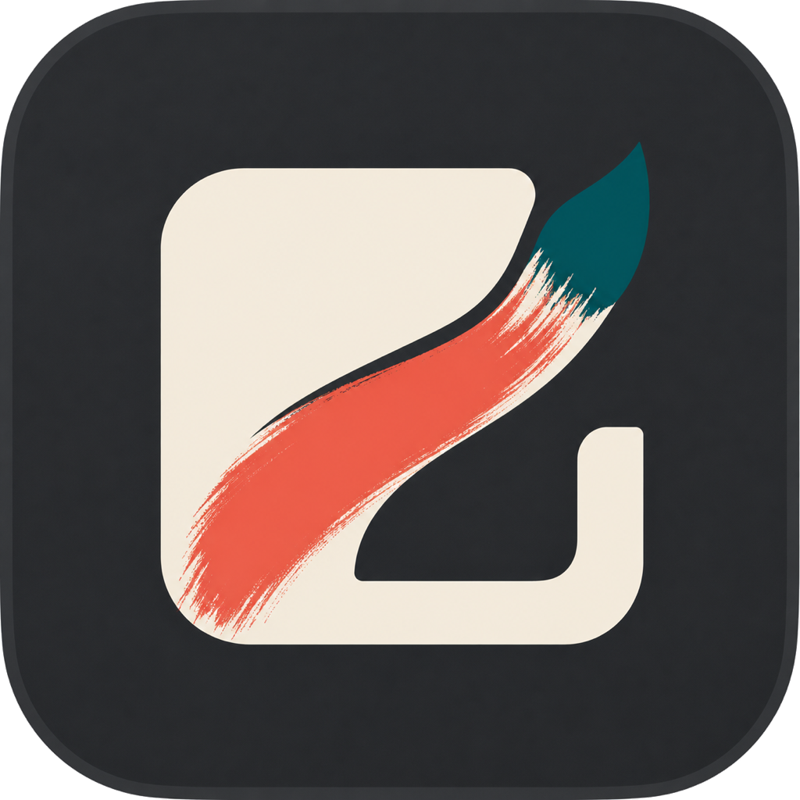
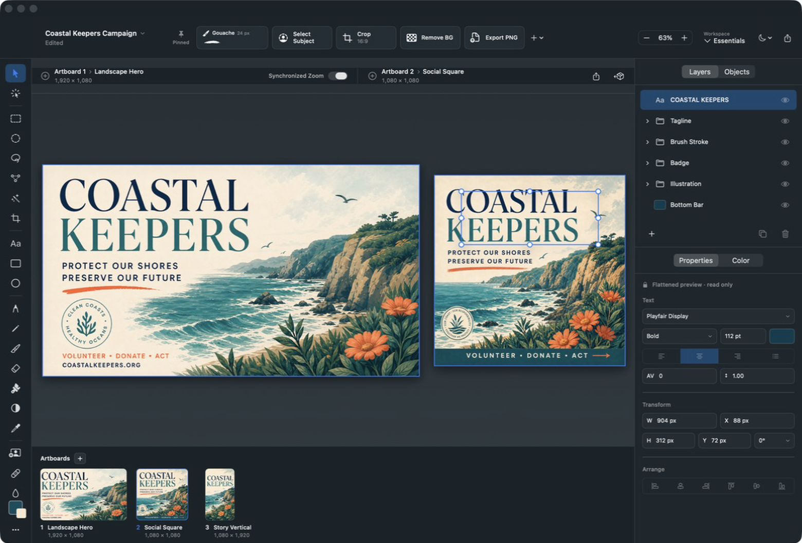

# MacOSPaint

<p align="center">
  
</p>

MacOSPaint is a native, local-first image editor for Apple-silicon Macs. It
combines an approachable Paint-like workflow with layered raster editing,
editable vector objects, freeform artboards, pressure-aware drawing, and a
customizable macOS studio.

> [!IMPORTANT]
> This repository is an early source-first vertical slice. The native document
> engine and core studio workflow are being built in public; it is not yet a
> replacement for a production image editor.



The checked-in [light](docs/design/selected-light.png) and
[dark](docs/design/selected-dark.png) visual targets document the selected
product direction. Demo artwork provenance is documented in
[docs/ASSET_PROVENANCE.md](docs/ASSET_PROVENANCE.md).

## Current vertical slice

- Freeform multi-artboard project model with stable identifiers.
- Raster, vector, text, and group layer records.
- Sparse 256×256 raster tile storage and immutable render snapshots.
- Transaction-shaped edits with named undo payloads.
- Versioned `.macospaint` package persistence.
- Native SwiftUI/AppKit studio matching the selected light and graphite themes.
- Original multi-resolution macOS app icon matching the studio palette.
- Full 25-tool rail plus a workspace-specific shelf that can pin any tool or
  special workflow action.
- Side-by-side artboard editing and a persistent bottom artboard filmstrip.
- Layer-owned, pressure-aware brush strokes that save into sparse tiles and
  render again when a `.macospaint` project is reopened.
- Pressure, tilt, rotation, eraser, mouse, and trackpad input contracts.

See [the roadmap](docs/ROADMAP.md) for the broader v1 tool plan.

## Requirements

- Apple-silicon Mac
- macOS 26 or later
- Swift 6.2 or later
- Xcode 26.x for app-bundle, signing, and UI-test workflows

The model, engine, persistence, and executable target can be compiled with the
matching Swift command-line toolchain:

```sh
swift build
./Scripts/test.sh
swift run MacOSPaint
```

The test wrapper supplies the framework and runtime search paths omitted by a
Command Line Tools-only installation. With full Xcode selected, it delegates
to a normal `swift test`.

## Project structure

- `PaintModel`: project, artboard, layer, vector, input, transaction, and
  workspace contracts.
- `PaintEngine`: sparse tile storage, brush sampling, and render snapshots.
- `PaintIO`: atomic `.macospaint` package persistence and import/export seams.
- `MacOSPaintApp`: native macOS studio and vertical-slice interactions.

Architecture and file-format details live in
[docs/ARCHITECTURE.md](docs/ARCHITECTURE.md) and
[docs/FILE_FORMAT.md](docs/FILE_FORMAT.md).

## Privacy

MacOSPaint is local-first. The v1 app has no accounts, telemetry, managed cloud
sync, generative AI, or collaboration backend. On-device subject selection is
planned through Apple Vision without an upload fallback.

## Contributing

Read [CONTRIBUTING.md](CONTRIBUTING.md) before opening a pull request. Bugs and
feature proposals are welcome through GitHub Issues and Discussions.

## License

MacOSPaint is available under the [MIT License](LICENSE).

MacOSPaint is an independent project and is not affiliated with Apple,
Microsoft, or Adobe. Product and company names belong to their respective
owners.
